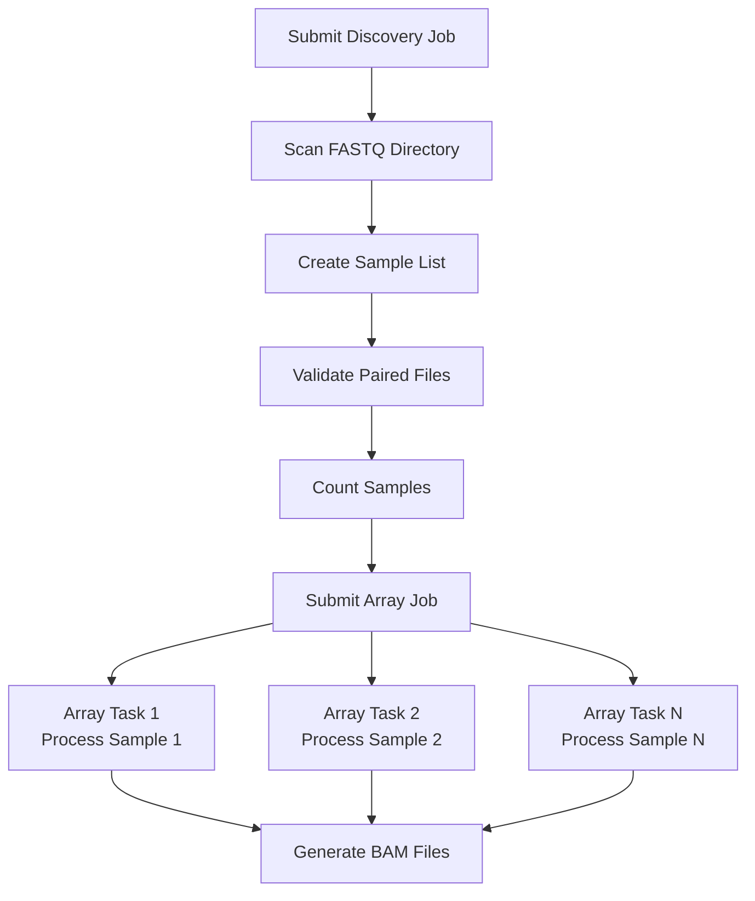

# STAR RNA-seq Mapping Pipeline

The STAR Mapping Pipeline is outlined below:

## Pipeline Workflow



## Customization

### Modifying STAR Parameters
Edit `star_map_array.slurm` to adjust STAR parameters:
```bash
STAR --runThreadN $SLURM_CPUS_PER_TASK \
    --genomeDir $STAR_FILE \
    --readFilesIn $FASTQ_FILES_CONTAINER \
    --readFilesCommand zcat \
    --outSAMstrandField intronMotif \
    --limitBAMsortRAM 89519393895 \
    --outSAMtype BAM SortedByCoordinate \
    # Add your custom parameters here
```

### Changing Resource Allocation
Modify SLURM parameters in `star_map_array.slurm`:
```bash
#SBATCH --cpus-per-task=48     # CPU cores
#SBATCH --mem=96gb             # Memory
#SBATCH --time=3:00:00         # Time limit
```

## Example Usage

```bash
# 1. Build STAR index (one-time)
sbatch star_index.sh

# 2. Copy FASTQ files to input directory
cp /path/to/fastqs/*.fastq.gz /project/rcc/hyadav/genomes/transcript_data/fastqs/

# 3. Submit discovery job
MAX_CONCURRENT_JOBS=5 sbatch star_discover_submit.slurm

# 4. Monitor progress
watch -n 30 'squeue -u $USER'

# 5. Check results
cd /project/rcc/hyadav/genomes/transcript_data/bams/
ls -lh 

# 6. Merge BAM files using samtools
module load samtools
samtools merge --threads 4 -o merged.bam *.bam
```

